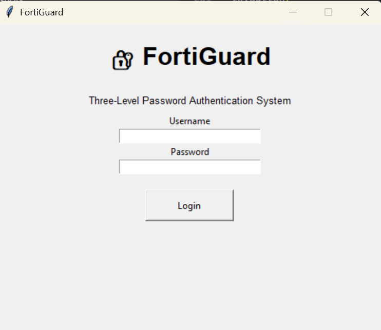
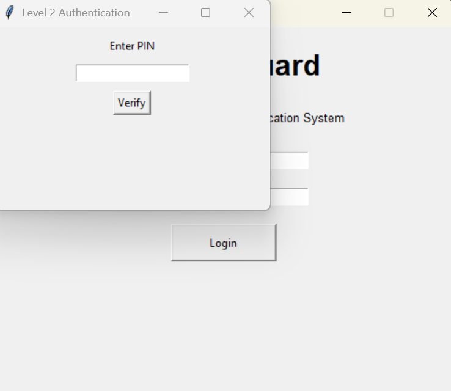
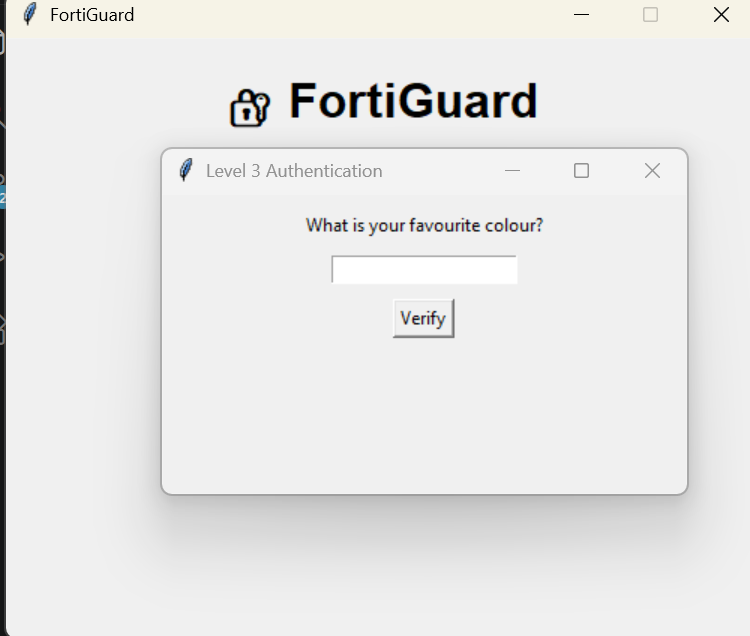
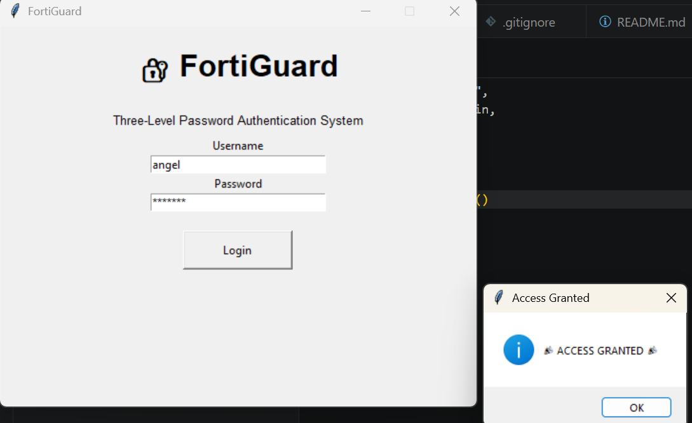

# 🔐 FortiGuard

A Three-Level Password Authentication System developed using Python, Tkinter, SQLite, and SHA-256 hashing.

## 📌 Overview

FortiGuard is a multi-layer authentication system that enhances security by requiring users to pass three verification stages before gaining access.

The system combines:

- Username & Password Authentication
- PIN Verification
- Security Question Verification

All authentication credentials are securely stored using SHA-256 hashing.

---

## ✨ Features

- User Registration
- SQLite Database Integration
- SHA-256 Password Hashing
- SHA-256 PIN Hashing
- SHA-256 Security Answer Hashing
- Three-Level Authentication
- GUI Interface using Tkinter
- Login Attempt Protection (3 Attempts)
- Git Version Control

---

## 🛠 Technologies Used

| Technology | Purpose |
|------------|----------|
| Python | Core Programming |
| Tkinter | GUI Development |
| SQLite | Database |
| hashlib | SHA-256 Hashing |
| Git | Version Control |
| GitHub | Project Hosting |

---

## 🔄 Authentication Workflow

```text
Username + Password
        ↓
Level 1 Passed
        ↓
PIN Verification
        ↓
Level 2 Passed
        ↓
Security Question
        ↓
🎉 ACCESS GRANTED 🎉
```

---

## 📂 Project Structure

```text
FortiGuard/
├── database.py
├── register.py
├── login.py
├── gui.py
├── README.md
├── .gitignore
└── screenshots/
    ├── login.png
    ├── pin.png
    ├── security.png
    └── access.png
```

---

## 📸 Screenshots

### Login Screen



### PIN Verification



### Security Question



### Access Granted



---

## 🚀 How to Run

### Clone Repository

```bash
git clone https://github.com/angel-ravikumar/FortiGuard.git
```

### Open Project

```bash
cd FortiGuard
```

### Create Database

```bash
python database.py
```

### Register User

```bash
python register.py
```

### Launch Application

```bash
python gui.py
```

---

## 🔮 Future Enhancements

- Email OTP Verification
- Password Reset Feature
- Flask Web Version
- MySQL Integration
- Role-Based Authentication
- Docker Deployment

---

## 👩‍💻 Author

Angel R

Developed as an internship cybersecurity project using Python.